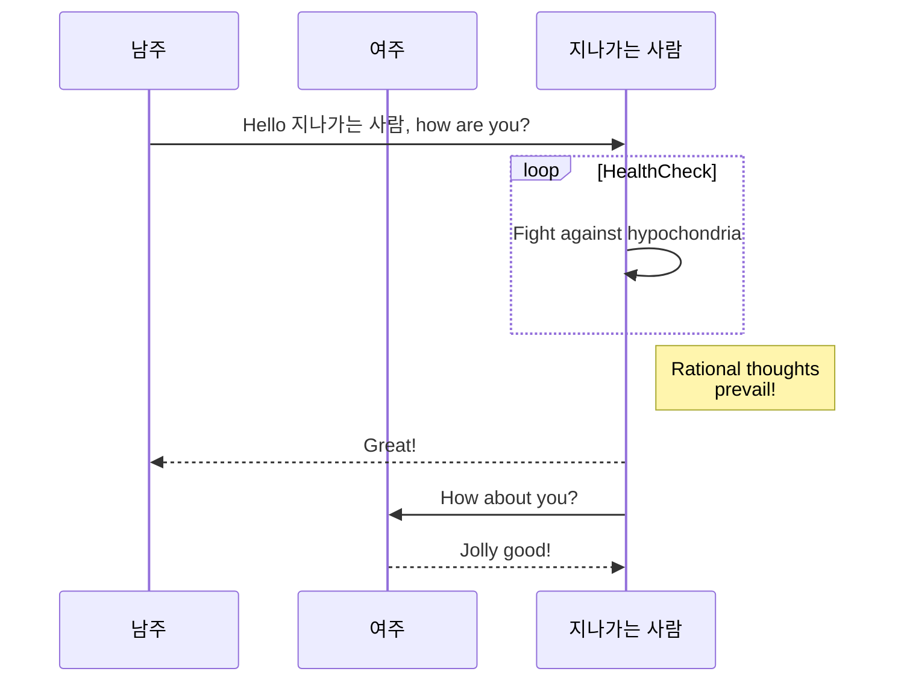
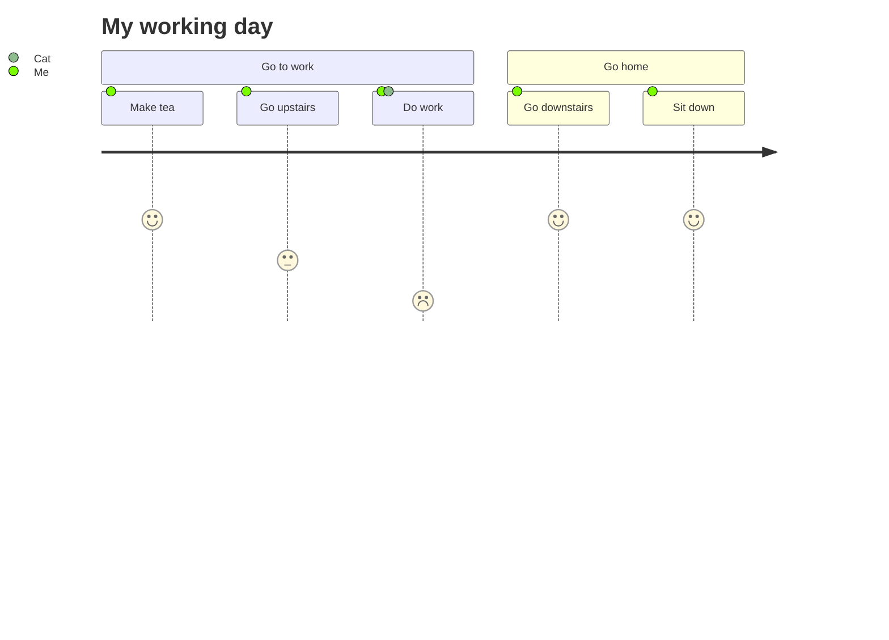
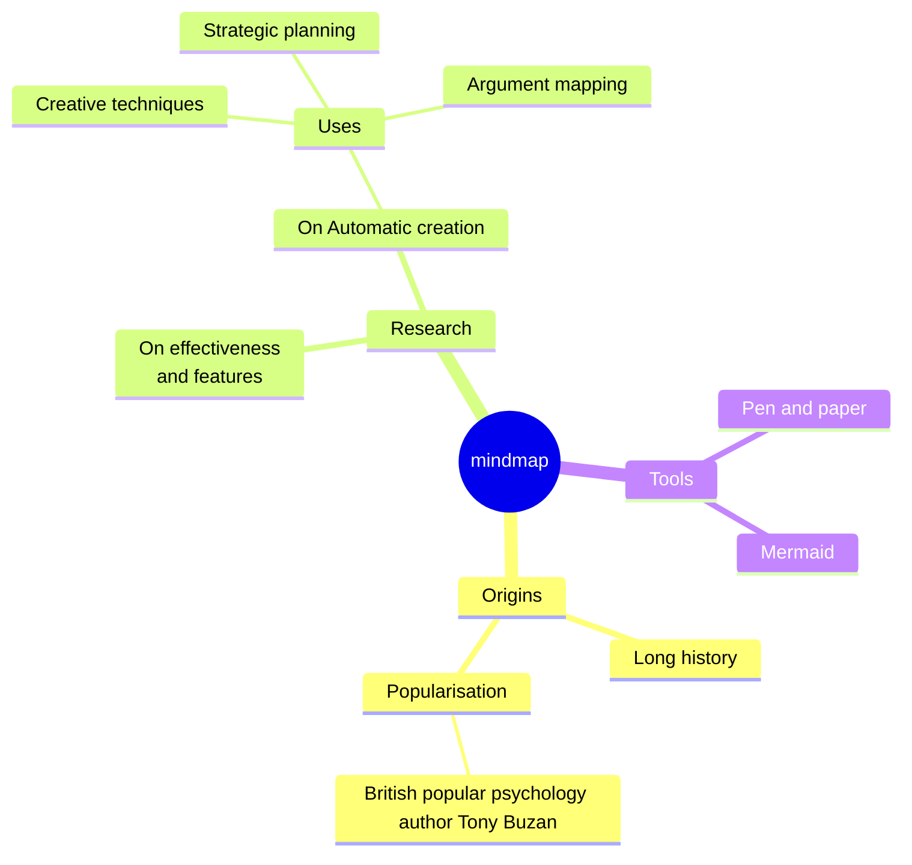

<script setup>
    /*
    import { Previewer } from 'pagedjs';
    import { onMounted } from 'vue';

    onMounted(() => {
        startPreview();
    });

    const startPreview = () => {
        const previewer = new Previewer();
        previewer.preview().then((flow) => {
            console.log('Rendered', flow.total, 'pages.');
        });
    };
    */
    import { onMounted } from 'vue';
    import mermaid from 'mermaid';

    onMounted(() => {
        mermaid.initialize({ startOnLoad: true });
        mermaid.init(undefined, document.querySelectorAll('.mermaid'));
    });
</script>

<style type="text/css">
    .commit-label-bkg,
    .commit-label { /* transform: none !important; */ }
</style>

# Character flow

## Graph



## Code

```mmd
sequenceDiagram
    participant 남주
    participant 여주
    남주->>지나가는 사람: Hello 지나가는 사람, how are you?
    loop HealthCheck
        지나가는 사람->>지나가는 사람: Fight against hypochondria
    end
    Note right of  지나가는 사람: Rational thoughts <br/>prevail!
    지나가는 사람-->>남주: Great!
    지나가는 사람->>여주: How about you?
    여주-->>지나가는 사람: Jolly good!
```

<!--
```mmd
gitGraph LR:
    commit
    commit
    branch feature
    commit
    commit
    checkout main
    commit
    commit id: "to-pick"
    checkout feature
    commit
    cherry-pick id: "to-pick"
    commit
    checkout main
    commit
    merge feature
    commit
    commit
```



```mermaid
flowchart LR
  Start --\> Stop
```



```mermaid
graph LR;
    K([......................])-.->G((......................));
    H([......................])-.->G
    G--\>A;
    A(......................)--\>D(......................);
classDef img fill:none,color:transparent,stroke:none,borderRadius:50px
class G,D,A,K,H,B img
click K "https://kustomize.io/" _blank
click G "http://www.github.com" "This is a link" _blank
``` -->
